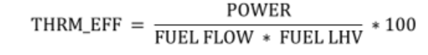
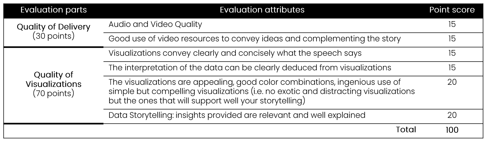

# Baker Hughes Challenge: Gas Turbine Data Visualization Challenge

## [NEW] Devpost Guidelines
1. Create a submission on [devpost](https://tamudatathon2022.devpost.com)
2. All submissions (virtual and in-person) should have video under 5 minutes.
3. **No in-person judging**

## Challenge Description
As an energy technology company, at Baker Hughes (BH) we approach to a sustainable energy future by deploying the most efficient and least emissive technologies. To help industry advance on the path to net-zero and a sustainable energy future, one of the strategies to follow is identify, control, and reduce emissions from operations.

## Objectives
- The main objective is to produce a video report with insights from the data using a set of visualizations with great storytelling that allows you to clearly communicate your findings. For this task, you are free to subset as you choose the:
    - **Emissions theme**: worst cases, best cases, timeline report, etc.
    - **Level of analysis**: gas turbine, site, customer, etc.
    - **Type of charts**: for example -- bar, lines, scatter, pie, map, KPIs, gauge, treemap, etc.
    - **Functionality of visualizations**: interactive, responsive, etc.

The video should not exceed 5 minutes.

Let's code and take energy forward!🙌

## Data Description
In this challenge, we provide a synthetic dataset for the operation of gas turbine engines from different customer sites around the world.

One of the data tags you have is the speed of the compressor, from which you can obtain operating hours, which could be useful in your storytelling.

- HOURS: operating hours in h. This attribute is the accumulated operation time based on the measurements of the compressor speed. The gas turbine engine is considered to be running when two consecutive measurements of the compressor speed are greater than zero, then this sampling time is added to the operating hours count. The starting value of HOURS for all gas turbine engines is zero. You may assume that the gas turbine engines reach a non-zero speed instantly.

**Files**
- [`site_metadata.csv`](./bakerhughes/site_metadata.csv)
- [`engine_metadata.csv`](./bakerhughes/engine_metadata.csv)
- [`all_data_v2.zip`](./bakerhughes/all_data_v2.zip)

**Columns**

Columns in `site_metadata.csv`:
- CUSTOMER_NAME: name of customer.
- PLANT_NAME: name of site.
- LATITUDE: in degrees.
- LONGITUDE: in degrees.
- ELEVATION: in meters.
- FUEL_LHV: lower heating value of the fuel in BTU/lb.

Columns in `engine_metadata.csv`:
- CUSTOMER_NAME: name of customer.
- PLANT_NAME: name of site.
- ENGINE_ID: engine name.
- FILE_ID: filename with data collected from gas turbine engines.

Columns in files `data_#.csv` included in `all_data_v2.zip`:
- DATE: datetime of measurement.
- CMP_SPEED: compressor speedin RPM.
- POWER: power output from the Low-Pressure Turbine (LPT) in kW.
- FUEL_FLOW: fuel flow into the combustor in kg/s.
- CO2: carbon dioxide estimated emissions in kg/s.

A parameter that is usually calculated for gas turbine engines that might be useful in your analysis is:
- THRM_EFF: thermal efficiency

## Evaluation
Data is a big world, it can be of several types, from different sources and have specific physical meanings; there is not always a set of defined tasks or steps to follow to retrieve valuable information from it. As professionals dedicated to Data Science, we must develop skills to optimally explore data and decide on what are the important leads to follow.

Creativity and good programming skills are two of the main qualities requried for data scientists during data exploration, and in the selection of the analysis approach to solve a problem. It is also crucial to present and communicate your results to the people responsible of decision making. In this challenge we would like you to demonstrate these abiltiies.

We expect you to explore the given data and tell a compelling story through the visualizations of your preference, clearly stating the problem or questions that your visualizations will help to answer. We will consider:

- **Clarity** of the analyzed data and its relevance to the proposed problem/question.
- **Accuracy** of the graphical representation used to convey your message.
- Efficiency of **visual effects** (use of appropriate shapes, colors and sizes to reresent the analyzed data).

Challenge evaluation score table:

## References
**Most popular Python libraries for visualization**:
- [Matplotlib](https://matplotlib.org/)
- [Seaborn](https://seaborn.pydata.org/)
- [Plotly](https://plotly.com/python/)
- [Jupyter Widgets](https://ipywidgets.readthedocs.io/en/latest/)
- [Folium](https://python-visualization.github.io/folium/)

**Improve your skills in visualization and data storytelling**:
- [Data Visualization Tutorial for Beginners](https://www.youtube.com/watch?v=MiiANxRHSv4&feature=youtu.be) (with python) by Simplilearn
- [Storytelling with data chart guide](https://www.storytellingwithdata.com/chart-guide)
- [Create an Infographic Using Matplotlib](https://towardsdatascience.com/create-an-infographic-using-matplotlib-3fbb546c1628)
- [Report examples](https://es.venngage.com/blog/plantillas-informe-anual/%E2%80%8B)
- [Infographic example](https://www.raconteur.net/infographics/how-big-is-your-businesss-carbon-footprint/)
- [Dashboard examples](https://www.codewall.co.uk/best-dashboard-examples-for-inspiration/)
- Data visualizations MOOCs:
    - [Data Visualization with Python](https://es.coursera.org/learn/python-for-data-visualization) by IBM
    - [Fundamentals of Data Visualization](https://es.coursera.org/learn/fundamentals-of-data-visualization) by University of Colorado
- Data visualization talks-books:
    - Storytelling with Data by Cole Nussbaumer Knaflic [talk](https://www.storytellingwithdata.com/books) [book](https://www.storytellingwithdata.com/books)
    - Designing Data Visualizations by Noah Iliinsky [talk](https://www.youtube.com/watch?v=R-oiKt7bUU8&feature=youtu.be) [book](https://www.youtube.com/watch?v=R-oiKt7bUU8&feature=youtu.be)

**About Baker Hughes**:
- [We are Baker Hughes, an energy technology company](https://www.youtube.com/watch?v=pHE7BUnil6I)
- [Energy transition](https://www.bakerhughes.com/energy-transition)
- [The path to net-zero and a sustainable energy future](https://www.bakerhughes.com/sites/bakerhughes/files/2021-10/Baker%20Hughes%20-%20The%20path%20to%20net-zero%20and%20a%20sustainable%20energy%20future.pdf)
    - [Episode 1](https://www.youtube.com/watch?v=tB_mcOSEy_Y&feature=youtu.be)
    - [Episode 2](https://www.youtube.com/watch?v=VeX3Iafrlx8)
