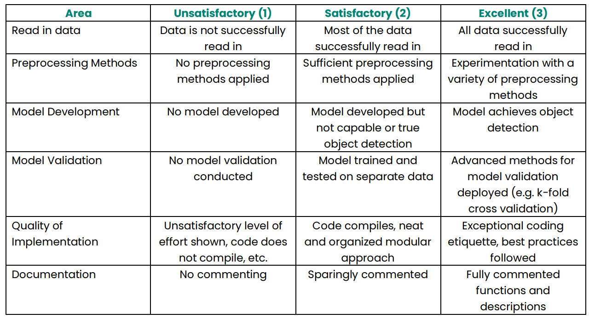

# Baker Hughes Challenge: Object Detection in Advanced Manufacturing

## [NEW] Devpost Guidelines
1. Create a submission on [devpost](https://tamudatathon2022.devpost.com)
2. Your devpost submission should have a link to a GitHub repo with your submission files
3. A video describing your submission is recommended, but not required. Upload your video to YouTube, and link it to your devpost submission

## Introduction
The landscape of manufacturing is evolving rapidly and leading disruptive technology in the energy
transition. As the technology matures, it is vital to better understand the processes and employ advanced
analytics. In-situ process monitoring in additive manufacturers enables us to look into the build process of
these parts to further enable the detection of anomalies that will impact part quality. Before we get into the
anomaly detection, lets first see how to identify the objects on a build plate.

## Project Description
Your goal is to develop a model that will be capable of detecting objects (in this case parts) on a
typical build plate for a metal additive manufacturing modality. We will start simpler and get you familiar
with object detection using a sample dataset. You will be given a dataset comprised of images of flowers
and your goal will be to identify the shape of either the whole flowers or parts of the flower on each image.

When dealing with images, it will be important to consider the appropriate preprocessing methods
that will help your model to read the images, your choice in model for the object detection, and the
appropriate tuning of hyperparameters inherent to your model.

The scoring regime will examine you for your ability to read in the dataset, apply preprocessing
methods, develop a working object detection model, apply appropriate model validation techniques,
thought & implementation process for your overall algorithm, and appropriate commenting of your code to
enhance the readability.

The data and a walkthrough can be found at the following link: https://blog.paperspace.com/object-detection-segmentation-with-detectron2-on-paperspace-gradient/ .

## Additional Resources:
https://machinelearningmastery.com/how-to-train-an-object-detection-model-with-keras/
https://www.analyticsvidhya.com/blog/2021/06/image-processing-using-cnn-a-beginners-guide/

## Scoring Criteria

## Important
Please include a requirements text to run your code. Without the proper environment, our team will be
unable to run your model and judge it appropriately. 
