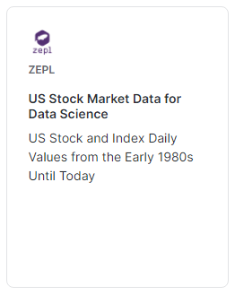
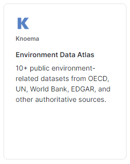
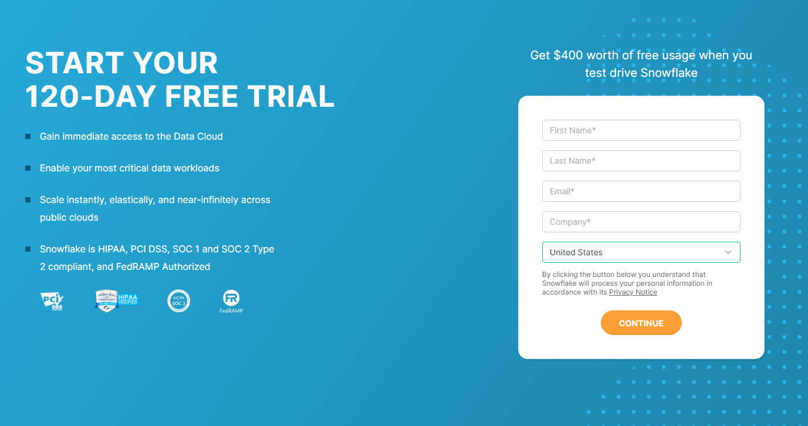
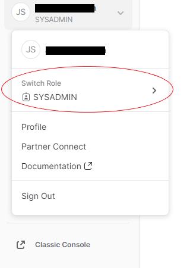

# Goldman Sachs Challenge

## Introduction
Data describing environments around the globe and documenting the behavior of financial markets has been collected for years. Modeling 
and machine learning allow us to spot trends and derive insights using the wealth of data available to us now. Our results can enable 
us to predict risk events, discover investment opportunities, and save entities and the environment from catastrophes.

## Description
The final product of your analysis and modeling should document how the environment and the markets are tied together, and should provide 
further insight into how impactful the environment and markets are on one another.

Two Data Sources for the challenge will be sourced from the Snowflake Data Marketplace:

## Getting Started with Snowflake Data Platform
1. Sign-Up for a Free Snowflake Account: https://signup.snowflake.com/?trial=student

2. After familiarizing yourself with the guided tour, navigate to the Data Marketplace

3. Set your "Role" to ACCOUNTADMIN

4. Search for and click on "Get Data" for the two data sources listed:

5. Navigate back to the Snowflake Console and begin working with the data through any of the supported methods Snowflake currently supports:

**Snowsight**: https://docs.snowflake.com/en/user-guide/ui-snowsight-gs.html  
**Snowflake Partner Connect**: https://docs.snowflake.com/en/user-guide/ecosystem-partner-connect.html   
**Snowflake Connectors**: https://docs.snowflake.com/en/user-guide/conns-drivers.html

## Judging
These are are some guiding questions and listed areas of focus that we will take into account when judging your submission:
- **Meaningful Insights from Data:**
   * How do you develop metrics and insights which support your thesis?
- **Dataset Usage/Integration:**
   * Which methods do you use to mine, manipulate, and enhance the data?
- **Data Normalization & Serialization:**
   * When blending multiple datasets from different sources:
      * How do you manage complexity? 
      * How do you maintain clean data?
      * How do you implement coherent transformations?
- **Communication:**
   * What will the final product look like?
   * How will you effectively convey your findings through your end-product?
- **Documentation:**
   * How will you shape your workflow and data usage documentation to clearly outline your methods while still meeting the timeline of the event?
- **Automation:**
   * How well will your models be able to accept new data and evolve to encourage future use?

## Prizes
**TBD**
