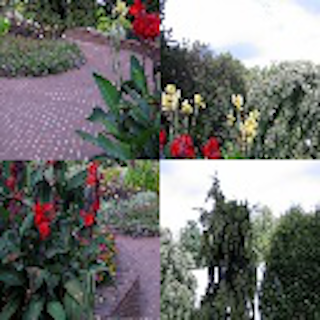

# TAMU Datathon Challenge: Puzzle Solver

## Introduction
Processing image information in an efficient way that extracts the needed information is a challenging task. As robots develop, they will need to do this, visualizing the outside world using sensors which give it a snapshot of what its environment is like. Reconstructing a jumbled image is a good way to gain insight into the key features which make up that image’s representation of the world.

## Description
For this challenge, you will be given an array of images. Your job is to write a program which can take this array of images and return it in the correct order such that it can construct the goal image.

There are two versions of this problem, one where you are given the final image to use in your algorithm, and a harder version where you are only given the scrambled image parts. 

Above is an example of a scrambled image

We will provide you with a set of training images. They will be similar to the example above. You should be able to deal with different types of images(grayscale vs rgb, different dimensions, etc.).

When we are testing your code, we will use some unique images that you do not have access to. 

As input you can expect:
A folder of scrambled images.

For output, we expect:
The unscrambled version of each image.

## Resources
This talks about unscrambling some real images (like shredded documents and double scrambled images).
[unscrambling images](https://dahtah.github.io/imager/unshuffle.html)

This seems like some good information in figuring out pixel relationships.
[pixel relationships](https://www.philadelphia.edu.jo/academics/qhamarsheh/uploads/Lecture_8_Basic_Relationships_between_Pixels.pdf)

This is some information about using neural networks for image classification, which could be a useful tool in trying to solve this problem.
[image classification](https://medium.com/swlh/a-hello-world-into-image-recognition-with-mnist-eb9b91520db4)
 

## How to get started
We have provided some starter code for you to build off of. You can choose to use a completely different method if you would like, just make sure that the class you are submitting has the required functions and return types as specified by the starter_code.py file. 

## Quick start
TODO put our own code here

## Judging
Output files which are closer to the target output file will be scored higher. A similarity score is computed, with 100 being a completely correct answer, and 0 being a completely incorrect answer. We will judge your program across multiple target and scrambled images. 

## Prizes
**1st Place**: Prize1

**2nd Place**: Prize2

**3rd Place**: Prize3