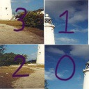

# TAMU Datathon Challenge: Puzzle Solver

## Description
For this challenge, you will be given a scrambled image.

Your job is to write a program which can take this scrambled image, and return a string representing the ordering of the pieces that is required to unscramble this image.

Above is an example of a scrambled image, with purple numbers indicating where each puzzle piece should have been placed.

- 0 indicates the top left position
- 1 indicates the top right position
- 2 indicates the bottom left position
- 3 indicates the bottom right position

Using the above image, your program would be expected to return the string "3120".

We will provide you with a set of [training images](https://drive.google.com/file/d/1tQTwXA3Z_ISTAZPScEz8baUYqgafRtpQ/view?usp=sharing). They will be similar to the example above. All images will be 128x128 RGB pixels. All puzzles will be 2x2.

When we test your code, we will use many unique images that you do not have access to.

## Code Structure
We have provided starter code for you to build off of. You can choose to use a completely different method if you would like, just make sure that the directory structure, filenames, class name, and function name and signature you submit is consistent with the structure detailed below (and in the starter code template). 

src
├── submission.py
│   └── class Predictor
│       └── def make_prediction(self, img_path) return str
├── requirements.txt
└── [any other files your solution needs]

Check out the starter code in the section below for a working example submission.

## Starter Code
[starter code](https://drive.google.com/file/d/1xFX9b1OwwQ9VCkQqL7B9DxykqP7vqnfi/view?usp=sharing)

[training images](https://drive.google.com/file/d/1tQTwXA3Z_ISTAZPScEz8baUYqgafRtpQ/view?usp=sharing)

## Submission
- When ready to submit, zip the src folder, and submit the zipped folder (named src.zip).
- src.zip should unzip to a folder called src. Do not directly zip just the contents of the src folder.
- Your submission should be of the following form:

src.zip
└── src
    ├── submission.py
    │   └── class Predictor
    │       └── def make_prediction(self, img_path) return str
    ├── requirements.txt
    └── [any other files your solution needs]

**[Submit your zipped file here](https://docs.google.com/forms/d/e/1FAIpQLSfMIe69QkRnm4950rvO-JNBoNmDK9M9FnEZt_q4-Ltu8rt19Q/viewform)**

## Resources
This talks about unscrambling some real images (like shredded documents and double scrambled images).
[unscrambling images](https://dahtah.github.io/imager/unshuffle.html)

This seems like some good information in figuring out pixel relationships.
[pixel relationships](https://www.philadelphia.edu.jo/academics/qhamarsheh/uploads/Lecture_8_Basic_Relationships_between_Pixels.pdf)

This is some information about using neural networks for image classification, which could be a useful tool in trying to solve this problem.
[image classification](https://medium.com/swlh/a-hello-world-into-image-recognition-with-mnist-eb9b91520db4)

## Judging
We will judge your program across many images in our secret scrambled dataset. Only outputs that match exactly with the intended un-scramble order will be counted towards your submission.

## Prizes
**1st Place**: iPad (latest) per team member

**2nd Place**: AirPod Pros per team member

**3rd Place**: $100 Visa Gift card per team member
